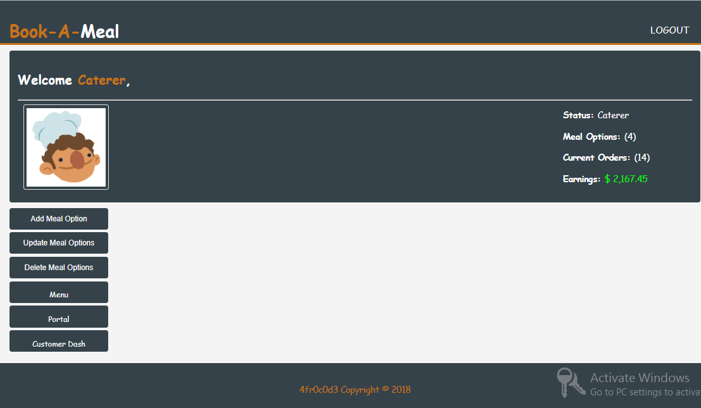
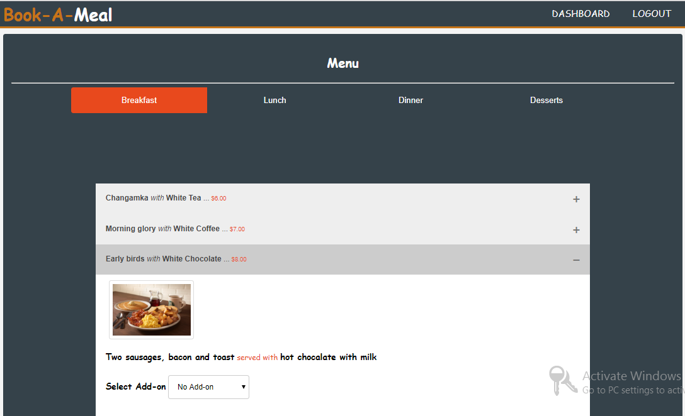
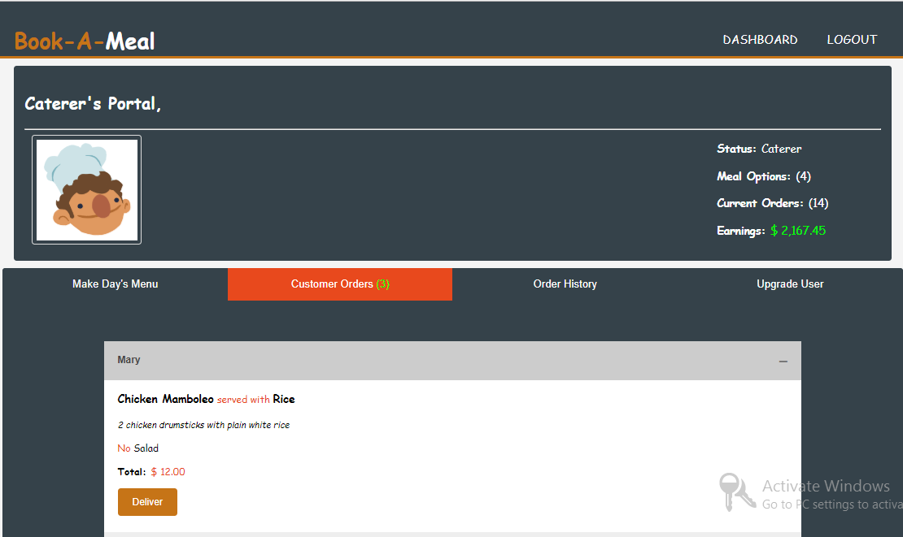

# Book-A-Meal
Book-A-Meal is an application that allows users (customers) to make food orders and helps the admins (food vendors) know what the customers want to eat. The front-end is done in HTML 5, CSS 3 and JavaScript powered with a Python-Flask back end. 

#Book-A-Meal UI Templates
You can view my templates here --> https://srmoffat.github.io/Book-A-Meal/UI/index.html

# Dashboard

# Menu

# Orders

